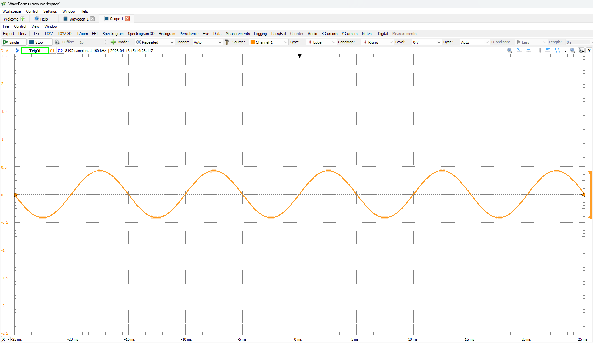
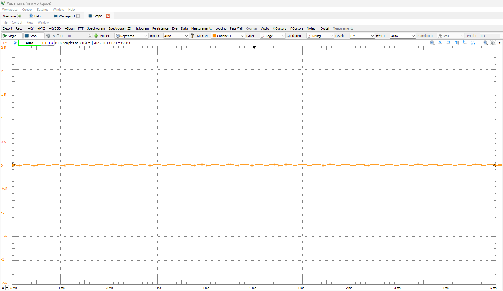

# Configurable Lowpass Chebyshev Filter

## Overview
This project implements a configurable lowpass Chebyshev filter, optimized for use with the STM32 Discovery board. The filter design is aimed at applications requiring precise signal processing capabilities while maintaining ease of integration with the STM32 microcontroller family.

## Features
- **Configurable Cut-off Frequency**: Adjust the cut-off frequency to suit various applications.
- **Low Distortion**: Maintains signal integrity with minimal phase and amplitude distortion.
- **User-friendly Interface**: Simplified configuration options to enhance usability.

## Getting Started
To get started with this project, you will need the following:
- STM32 Discovery board
- STM32 development tools
- Basic understanding of digital signal processing

### Prerequisites
- **Software:**
  - Keil Microvision 5
  - Required STM32 libraries and dependencies

### Installation Steps
1. Clone the repository:
   ```bash
   git clone https://github.com/Radonoxius/Chebychev-Filter.git
   ```
2. Open the project in Keil.
3. Configure the project settings according to your requirements.

## Usage
To utilize the Chebyshev filter in your application:
1. Initialize the filter parameters (cut-off frequency, order, etc.).
2. Integrate the filter into your signal processing pipeline.
3. Test the implementation to ensure correct functionality.

##Demo
This is the waveforms we got from the oscilloscope when the cutoff frequency was set at 1000Hz.

For 100Hz, we got:



and for 3300Hz, we got:



As it can be seen, any frequency above 1000Hz is severely attenuated.

## Contributing
We welcome contributions to improve this project. Please follow the guidelines below:
- Fork the repository and create a new branch for each feature or bugfix.
- Write clear and descriptive commit messages.
- Submit a pull request for review.

## License
This project is licensed under the MIT License - see the [LICENSE](LICENSE) file for details.

## Acknowledgments
- Special thanks to our professor so that we can work on this project.

For more information, issues, or feature requests, please open an issue in the GitHub repository.